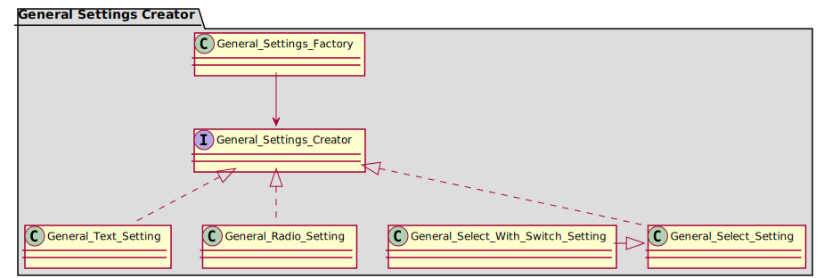

# Tabs With Recommended Posts - Development Notes

## Plugins Used

### Rating Plugins

#### YASR Rating Plugin

    - ✔ Can get the rating for a post.
    - ❌ Can NOT order the posts via rating.

#### BlazK Rating Plugin

    - ✔ Can get the rating for a post.
    - ✔ Can order the posts via a post meta.
    - ✔ Functions used are don't have a chance to change in future, and even, a
    deprecation warning might be displayed(as in other parts of the code).

## ✅ Todo

### Query Settings

- Finish Advanced Arguments.
- Meta Value: Maybe do not add meta_value if the comparator is Exist or not exist. Maybe try to
detect if an int is present in intval, and add as a comparator to int. Maybe add a note that
say leave empty to not apply, or add a checkbox that must be checked to apply the setting.

- Call init on every setting classes that have something in that function.

- Create a nice query tab, including the message when no queries are present. Maybe move the actions button to the right?

- Date Filter: Hide note 2 when not necessary. Change name of note 2. Bring last
- checkbox(last days to first checkbox). Change the first note to a good explication(hard).
- Meta Settings verify if add_query_args is good, hasn't been verified before.
- When settings are saved, redirect to table of queries, not edit queries.

- Remove "No order" from posts order setting. Is very confusing especially if
is not selected.

- Remove order from orderby that does not depend, like post__in

- In author setting, and maybe in all other, when searching for an author and selecting with
arrows/mouse hover, no css indication of the element selected is done.

- Search and remove this class: twrp-collapsible-content__section-title and this twrp-admin-settings-separator and twrp-collapsible-content.

- Add a way when selected views/rating/popular posts plugin, to select only the first installed, the rest should be disabled.

- change all WP button classes with twrpb-button.

### Plugins

- Make Plugin DFactory Block Suppress filter option.
- GamerZ/BlazK: Sort by most rated/unrated posts.
- Site Reviews Plugin has a custom Category Id ratting, Think if we should implement that.
- Don't know how to count site reviews ratings, maybe email for support?
- Add each plugin, move orderby plugin indicators to classes.
- Test a plugin as a MU plugin to see with debugger how function Post_Meta::get_plugin_version() get the plugin keys, maybe we will need
to make another get_plugin_file_relative_path for MU plugins?.

### Widget

- Add regions is typescript files
- Add margin between before/after text and control.
- Add label and for attribute for checkbox control.
- Test a SVG color icon to see if the "fill" property will change it.

### General

!- Move all General Settings into a class.

- There should be a function for human diff in Utilities.
- Remove twrp_get_name and id from widget utilities.
- When displaying the widget page there is an exception, most likely from first widget with id 0. Fix it.
- Change all "twrp" css/classes backend prefix with "twrpb"
- Custom date format, make it disabled(not to hide).

- In Gulp, when a SCSS file fail to compile, no error is displayed. Try to fix it. For example, if we add an import
that does not exist, the gulp won't show an error, it just will not compile.

- Move the class order to a trait

### Icons

- Make icons work inline(add before tabs, only one time, but we will do this later), and make them the default behavior.
- In tests, add coverage for each method.

#### General Settings

- Change twrp to twrpb classes, change also ts filename, make ts scripts to work.
- Add a diagram, and explain everything, how this package works.
- Change by default to include icons inline?
- Add a help button, and with a pop-out to document something, also the document
might be exactly as in documentation.

### JS/SCSS

- Need to do something with jquery-ui-datepicker. Best thing to do is to prefix
it with twrpb or something like that.

### Today

- Split all Query_Settings classes in half, and move them inside admin menu.
- Add a way to order query settings.

### After first release

- 🥇 Add taxonomy options(with post formats).
- 📬 Add filters for all things.
- Put all Query Notes in a separate class.
- 🔀 Add a way to invert category icons?

## Read Before Development

This documentation is split between packages.

### TWRP\Admin\ Package

#### TWRP\Admin\General_Settings Package

The only access to create the settings should be through
General_Settings_Factory class. This class, contains a public static method
display(), in which, giving a setting name, will display the specific setting
into the form.

