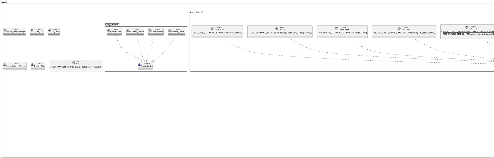

```plantuml
@startuml

top to bottom direction
namespace TWRP.Admin {
  class General_Settings_Factory << class >> {
    +{static} SETTING_CLASSES_NAMESPACE : string = "TWRP\\Admin\\" {readOnly}
    +{static} SETTING_CLASS_CREATOR : string = "General_Setting_Creator" {readOnly}
    +{static} SELECT_SETTING_CLASS : string = "General_Select_Setting" {readOnly}
    +{static} RADIO_SETTING_CLASS : string = "General_Radio_Setting" {readOnly}
    +{static} TEXT_SETTING_CLASS : string = "General_Text_Setting" {readOnly}
    +{static} SELECT_SETTING_WITH_SWITCH_CLASS : string = "General_Select_With_Switch_Setting" {readOnly}

    --
  }
  class General_Radio_Setting << class >> {
    --
  }
  class General_Setting_Creator << class >> {
    +{static} ADDITIONAL_BLOCK_CLASS_NAME : string = "twrpb\-general\-settings__setting\-group" {readOnly}
    +{static} SETTING_IS_HIDDEN_CLASS_NAME : string = "twrp\-hidden" {readOnly}

    --
  }
  class General_Select_Setting << class >> {
    --
  }
  class General_Select_With_Switch_Setting << class >> {
    --
  }
  class General_Text_Setting << class >> {
    --
  }
  class License_Display << class >> {
    --
  }
  class Settings_Menu << class >> {
    +{static} MENU_SLUG : string = "tabs_with_recommended_posts" {readOnly}
    +{static} TAB__URL_PARAMETER_KEY : string = "tab" {readOnly}
    +{static} CLASSES : array = […] {readOnly}

    --
  }
}
namespace TWRP.Admin.Tabs {
  class Documentation_Tab << class >> {
    --
  }
  interface Interface_Admin_Menu_Tab << interface >> {
    --
  }
  class General_Settings_Tab << class >> {
    --
  }
  class Queries_Tab << class >> {
    +{static} TAB_URL_ARG : string = "query_posts" {readOnly}
    +{static} EDIT_QUERY__URL_PARAM_KEY : string = "query_edit_id" {readOnly}
    +{static} DELETE_QUERY__URL_PARAM_KEY : string = "query_delete_id" {readOnly}
    +{static} QUERY_NAME : string = "query_name" {readOnly}
    +{static} NONCE_EDIT_NAME : string = "twrp_query_nonce" {readOnly}
    +{static} NONCE_EDIT_ACTION : string = "twrp_edit_query" {readOnly}
    +{static} NONCE_DELETE_NAME : string = "twrp_query_delete_nonce" {readOnly}
    +{static} NONCE_DELETE_ACTION : string = "twrp_delete_query" {readOnly}
    +{static} SUBMIT_BTN_NAME : string = "twrp_query_submitted" {readOnly}

    --
  }
}
namespace TWRP.Artblock_Component {
  class Author_Icon_Setting << class >> {
    --
  }
  interface Component_Setting << interface >> {
    --
  }
  class Category_Icon_Setting << class >> {
    --
  }
  class Color_Setting << class >> {
    --
  }
  class Date_Icon_Setting << class >> {
    --
  }
  class Font_Size_Setting << class >> {
    --
  }
  class Font_Weight_Setting << class >> {
    --
  }
  class Hover_Color_Setting << class >> {
    --
  }
  class Line_Height_Setting << class >> {
    --
  }
  class Widget_Component_Settings << class >> {
    +{static} COMPONENTS_NAMESPACE_PREFIX : string = "TWRP\\Artblock_Component\\" {readOnly}
    +{static} FONT_SIZE_SETTING : string = "Font_Size_Setting" {readOnly}
    +{static} LINE_HEIGHT_SETTING : string = "Line_Height_Setting" {readOnly}
    +{static} FONT_WEIGHT_SETTING : string = "Font_Weight_Setting" {readOnly}
    +{static} COLOR_SETTING : string = "Color_Setting" {readOnly}
    +{static} TEXT_SETTINGS : array = […] {readOnly}
    +{static} HOVER_COLOR_SETTING : string = "Hover_Color_Setting" {readOnly}
    +{static} AUTHOR_ICON_SETTING : string = "Author_Icon_Setting" {readOnly}
    +{static} DATE_ICON_SETTING : string = "Date_Icon_Setting" {readOnly}
    +{static} CATEGORY_ICON_SETTING : string = "Category_Icon_Setting" {readOnly}

    --
  }
}
namespace TWRP.Article_Block {
  class Article_Block << class >> {
    --
  }
  class Display_Post_Meta_Trait << class >> {
    --
  }
  class Get_Settings_Trait << class >> {
    --
  }
  class Get_Widget_Settings_Trait << class >> {
    --
  }
  class Modern_Article_Block << class >> {
    --
  }
  class Simple_Article_Block << class >> {
    +{static} AUTHOR_ATTR : string = "author" {readOnly}
    +{static} DATE_ATTR : string = "date" {readOnly}
    +{static} TITLE_FONT_SIZE_ATTR : string = "font\-size" {readOnly}
    +{static} AUTHOR_FONT_SIZE_ATTR : string = "author\-font\-size" {readOnly}

    --
  }
}
namespace TWRP {
  class Article_Blocks_Manager << class >> {
    --
  }
  class Create_Tabs << class >> {
    --
  }
  class Get_Posts << class >> {
    --
  }
  class Query_Settings_Manager << class >> {
    --
  }
  class Require_Files << class >> {
    --
  }
  class Utils << class >> {
    +{static} HOW_MANY_FOLDERS_THIS_FILE_IS_NESTED : int = 1 {readOnly}

    --
  }
}
namespace TWRP.Database {
  class Aside_Options << class >> {
    +{static} TABLE_OPTION_KEY : string = "twrp__aside_options" {readOnly}
    +{static} KEY__NEEDED_ICONS_GENERATION_TIME : string = "needed_icons_generation_timestamp" {readOnly}

    --
  }
  class General_Options << class >> {
    +{static} KEY__PER_WIDGET_DATE_FORMAT : string = "per_widget_date_format" {readOnly}
    +{static} KEY__HUMAN_READABLE_DATE : string = "human_readable_date" {readOnly}
    +{static} KEY__DATE_FORMAT : string = "date_format" {readOnly}
    +{static} ICON_KEYS : array = […] {readOnly}
    +{static} KEY__AUTHOR_ICON : string = "user_icon" {readOnly}
    +{static} KEY__DATE_ICON : string = "date_icon" {readOnly}
    +{static} KEY__CATEGORY_ICON : string = "category_icon" {readOnly}
    +{static} KEY__COMMENTS_ICON : string = "comments_icon" {readOnly}
    +{static} KEY__COMMENTS_DISABLED_ICON_AUTO_SELECT : string = "comments_disabled_icon_auto_select" {readOnly}
    +{static} KEY__COMMENTS_DISABLED_ICON : string = "comments_disabled_icon" {readOnly}
    +{static} KEY__VIEWS_ICON : string = "views_icon" {readOnly}
    +{static} KEY__RATING_ICON_PACK : string = "rating_pack_icons" {readOnly}

    --
  }
  class Inline_Icons_Option << class >> {
    +{static} TABLE_OPTION_KEY : string = "twrp__inline_icons_definition" {readOnly}

    --
  }
  class Query_Options << class >> {
    +{static} QUERIES_OPTION_KEY : string = "twrp__post_queries" {readOnly}

    --
  }
}
namespace TWRP.Icons {
  class Create_And_Enqueue_Icons << class >> {
    --
  }
  class Category_Icons << class >> {
    --
  }
  class Comments_Disabled_Icons << class >> {
    --
  }
  class Comments_Icons << class >> {
    --
  }
  class Date_Icons << class >> {
    --
  }
  class Rating_Icons << class >> {
    --
  }
  class User_Icons << class >> {
    --
  }
  class Views_Icons << class >> {
    --
  }
  class Icon << class >> {
    --
  }
  class Rating_Icon_Pack << class >> {
    --
  }
  class SVG_Manager << class >> {
    +{static} USER_ICON : int = 1 {readOnly}
    +{static} DATE_ICON : int = 2 {readOnly}
    +{static} VIEWS_ICON : int = 3 {readOnly}
    +{static} RATING_ICON : int = 4 {readOnly}
    +{static} CATEGORY_ICON : int = 5 {readOnly}
    +{static} COMMENT_ICON : int = 6 {readOnly}
    +{static} DISABLED_COMMENT_ICON : int = 7 {readOnly}
    +{static} ICON_CATEGORY_FOLDER : array = […] {readOnly}
    +{static} ICON_CATEGORY_CLASS : array = […] {readOnly}

    --
  }
}
namespace TWRP.Plugins {
  class Plugin_Info << class >> {
    --
  }
  class Post_Rating << class >> {
    --
  }
  class Post_Views << class >> {
    --
  }
  class A3REV_Views_Plugin << class >> {
    --
  }
  class Post_Views_Plugin << class >> {
    --
  }
  class DFactory_Views_Plugin << class >> {
    +{static} ORDERBY_NAME : string = "post_views" {readOnly}

    --
  }
  class GamerZ_Views_Plugin << class >> {
    --
  }
  class BlazK_Plugin << class >> {
    --
  }
  interface Post_Rating_Plugin << interface >> {
    --
  }
  class GamerZ_Rating_Plugin << class >> {
    --
  }
  class KK_Rating_Plugin << class >> {
    --
  }
  class PaulR_Rating_Plugin << class >> {
    --
  }
  class YASR_Rating_Plugin << class >> {
    --
  }
}
namespace TWRP.Query_Setting {
  class Advanced_Arguments << class >> {
    +{static} IS_APPLIED__SETTING_NAME : string = "is_applied_setting" {readOnly}
    +{static} CUSTOM_ARGS__SETTING_NAME : string = "custom_args_json" {readOnly}

    --
  }
  interface Query_Setting << interface >> {
    --
  }
  class Author << class >> {
    +{static} AUTHORS_TYPE__SETTING_NAME : string = "setting_type" {readOnly}
    +{static} AUTHORS_IDS__SETTING_NAME : string = "authors" {readOnly}
    +{static} AUTHORS_TYPE__DISABLED : string = "DISABLED" {readOnly}
    +{static} AUTHORS_TYPE__INCLUDE : string = "IN" {readOnly}
    +{static} AUTHORS_TYPE__EXCLUDE : string = "OUT" {readOnly}
    +{static} AUTHORS_TYPE__SAME : string = "SAME" {readOnly}

    --
  }
  class Categories << class >> {
    +{static} CATEGORIES_TYPE__SETTING_KEY : string = "setting_type" {readOnly}
    +{static} INCLUDE_CHILDREN__SETTING_KEY : string = "include_children" {readOnly}
    +{static} RELATION__SETTING_KEY : string = "relation" {readOnly}
    +{static} CATEGORIES_HIDE_EMPTY : bool = false {readOnly}
    +{static} CATEGORIES_IDS__SETTING_KEY : string = "cat_ids" {readOnly}

    --
  }
  class Meta_Setting << class >> {
    +{static} META_KEY_NAME__SETTING_NAME : string = "meta_name" {readOnly}
    +{static} META_KEY_VALUE__SETTING_NAME : string = "meta_value" {readOnly}
    +{static} META_KEY_COMPARATOR__SETTING_NAME : string = "meta_comparator" {readOnly}

    --
  }
  class Password_Protected << class >> {
    +{static} PASSWORD_PROTECTED__SETTING_NAME : string = "password_protected" {readOnly}

    --
  }
  class Post_Comments << class >> {
    +{static} COMMENTS_VALUE_NAME : string = "value" {readOnly}
    +{static} COMMENTS_COMPARATOR_NAME : string = "comparator" {readOnly}

    --
  }
  class Post_Date << class >> {
    +{static} DATE_TYPE_NAME : string = "date_type" {readOnly}
    +{static} DATE_LAST_PERIOD_NAME : string = "last_period" {readOnly}
    +{static} DATE_LAST_DAYS_NAME : string = "last_days" {readOnly}
    +{static} BEFORE_DATE_NAME : string = "before" {readOnly}
    +{static} AFTER_DATE_NAME : string = "after" {readOnly}

    --
  }
  class Post_Order << class >> {
    +{static} FIRST_ORDERBY_SELECT_NAME : string = "first_orderby" {readOnly}
    +{static} SECOND_ORDERBY_SELECT_NAME : string = "second_orderby" {readOnly}
    +{static} THIRD_ORDERBY_SELECT_NAME : string = "third_orderby" {readOnly}
    +{static} FIRST_ORDER_TYPE_SELECT_NAME : string = "first_order_type" {readOnly}
    +{static} SECOND_ORDER_TYPE_SELECT_NAME : string = "second_order_type" {readOnly}
    +{static} THIRD_ORDER_TYPE_SELECT_NAME : string = "third_order_type" {readOnly}
    +{static} PLUGIN_DFACTORY_ORDERBY_VALUE : string = "post_views_dfactory" {readOnly}
    +{static} PLUGIN_GAMERZ_VIEWS_ORDERBY_VALUE : string = "post_views_gamerz" {readOnly}
    +{static} PLUGIN_BLAZK_ORDERBY_VALUE : string = "post_views_gamerz" {readOnly}
    +{static} PLUGIN_GAMERZ_RATING_ORDERBY_VALUE : string = "post_rating_gamerz" {readOnly}

    --
  }
  class Post_Settings << class >> {
    +{static} FILTER_TYPE__SETTING_NAME : string = "posts_filter" {readOnly}
    +{static} POSTS_INPUT__SETTING_NAME : string = "posts_ids" {readOnly}

    --
  }
  class Post_Status << class >> {
    +{static} APPLY_STATUSES__SETTING_NAME : string = "status_type" {readOnly}
    +{static} POST_STATUSES__SETTING_NAME : string = "selected_statuses" {readOnly}

    --
  }
  class Post_Types << class >> {
    +{static} SELECTED_TYPES__SETTING_NAME : string = "selected_post_types" {readOnly}

    --
  }
  class Query_Name << class >> {
    +{static} QUERY_NAME__SETTING_NAME : string = "name" {readOnly}

    --
  }
  class Search << class >> {
    +{static} SEARCH_KEYWORDS__SETTING_NAME : string = "search_keywords" {readOnly}

    --
  }
  class Sticky_Posts << class >> {
    +{static} INCLUSION__SETTING_NAME : string = "inclusion" {readOnly}

    --
  }
  class Suppress_Filters << class >> {
    +{static} SUPPRESS_FILTERS__SETTING_NAME : string = "suppress" {readOnly}

    --
  }
}
namespace TWRP.TWRP_Widget {
  class Widget << class >> {
    +{static} TWRP_BASE_ID : string = "twrp_tabs_with_recommended_posts" {readOnly}
    +{static} ARTBLOCK_SELECTOR__NAME : string = "article_block" {readOnly}
    +{static} QUERY_BUTTON_TITLE__NAME : string = "display_title" {readOnly}
    +{static} DEFAULT_SELECTED_ARTBLOCK_ID : string = "simple_style" {readOnly}

    --
  }
  class Widget_Ajax << class >> {
    --
  }
  class Widget_Form << class >> {
    --
  }
  class Widget_Utilities << class >> {
    --
  }
}
namespace TWRP.Widget_Control {
  class Checkbox_Control << class >> {
    --
  }
  interface Widget_Control << interface >> {
    --
  }
  class Color_Control << class >> {
    --
  }
  class Number_Control << class >> {
    --
  }
  class Select_Control << class >> {
    --
  }
}
TWRP.Admin.General_Radio_Setting --|> TWRP.Admin.General_Setting_Creator
TWRP.Admin.General_Select_Setting --|> TWRP.Admin.General_Setting_Creator
TWRP.Admin.General_Select_With_Switch_Setting --|> TWRP.Admin.General_Select_Setting
TWRP.Admin.General_Text_Setting --|> TWRP.Admin.General_Setting_Creator
TWRP.Admin.Tabs.Documentation_Tab ..|> TWRP.Admin.Tabs.Interface_Admin_Menu_Tab
TWRP.Admin.Tabs.General_Settings_Tab ..|> TWRP.Admin.Tabs.Interface_Admin_Menu_Tab
TWRP.Admin.Tabs.Queries_Tab ..|> TWRP.Admin.Tabs.Interface_Admin_Menu_Tab
TWRP.Artblock_Component.Author_Icon_Setting ..|> TWRP.Artblock_Component.Component_Setting
TWRP.Artblock_Component.Category_Icon_Setting ..|> TWRP.Artblock_Component.Component_Setting
TWRP.Artblock_Component.Color_Setting ..|> TWRP.Artblock_Component.Component_Setting
TWRP.Artblock_Component.Date_Icon_Setting ..|> TWRP.Artblock_Component.Component_Setting
TWRP.Artblock_Component.Font_Size_Setting ..|> TWRP.Artblock_Component.Component_Setting
TWRP.Artblock_Component.Font_Weight_Setting ..|> TWRP.Artblock_Component.Component_Setting
TWRP.Artblock_Component.Hover_Color_Setting ..|> TWRP.Artblock_Component.Component_Setting
TWRP.Artblock_Component.Line_Height_Setting ..|> TWRP.Artblock_Component.Component_Setting
TWRP.Article_Block.Modern_Article_Block --|> TWRP.Article_Block.Article_Block
TWRP.Article_Block.Simple_Article_Block --|> TWRP.Article_Block.Article_Block
TWRP.Plugins.Post_Views_Plugin --|> TWRP.Plugins.Plugin_Info
TWRP.Plugins.A3REV_Views_Plugin --|> TWRP.Plugins.Post_Views_Plugin
TWRP.Plugins.DFactory_Views_Plugin --|> TWRP.Plugins.Post_Views_Plugin
TWRP.Plugins.GamerZ_Views_Plugin --|> TWRP.Plugins.Post_Views_Plugin
TWRP.Plugins.BlazK_Plugin ..|> TWRP.Plugins.Post_Rating_Plugin
TWRP.Plugins.GamerZ_Rating_Plugin ..|> TWRP.Plugins.Post_Rating_Plugin
TWRP.Plugins.KK_Rating_Plugin ..|> TWRP.Plugins.Post_Rating_Plugin
TWRP.Plugins.PaulR_Rating_Plugin ..|> TWRP.Plugins.Post_Rating_Plugin
TWRP.Plugins.YASR_Rating_Plugin ..|> TWRP.Plugins.Post_Rating_Plugin
TWRP.Query_Setting.Advanced_Arguments ..|> TWRP.Query_Setting.Query_Setting
TWRP.Query_Setting.Author ..|> TWRP.Query_Setting.Query_Setting
TWRP.Query_Setting.Categories ..|> TWRP.Query_Setting.Query_Setting
TWRP.Query_Setting.Meta_Setting ..|> TWRP.Query_Setting.Query_Setting
TWRP.Query_Setting.Password_Protected ..|> TWRP.Query_Setting.Query_Setting
TWRP.Query_Setting.Post_Comments ..|> TWRP.Query_Setting.Query_Setting
TWRP.Query_Setting.Post_Date ..|> TWRP.Query_Setting.Query_Setting
TWRP.Query_Setting.Post_Order ..|> TWRP.Query_Setting.Query_Setting
TWRP.Query_Setting.Post_Settings ..|> TWRP.Query_Setting.Query_Setting
TWRP.Query_Setting.Post_Status ..|> TWRP.Query_Setting.Query_Setting
TWRP.Query_Setting.Post_Types ..|> TWRP.Query_Setting.Query_Setting
TWRP.Query_Setting.Query_Name ..|> TWRP.Query_Setting.Query_Setting
TWRP.Query_Setting.Search ..|> TWRP.Query_Setting.Query_Setting
TWRP.Query_Setting.Sticky_Posts ..|> TWRP.Query_Setting.Query_Setting
TWRP.Query_Setting.Suppress_Filters ..|> TWRP.Query_Setting.Query_Setting
TWRP.TWRP_Widget.Widget --|> WP_Widget
TWRP.Widget_Control.Checkbox_Control ..|> TWRP.Widget_Control.Widget_Control
TWRP.Widget_Control.Color_Control ..|> TWRP.Widget_Control.Widget_Control
TWRP.Widget_Control.Number_Control ..|> TWRP.Widget_Control.Widget_Control
TWRP.Widget_Control.Select_Control ..|> TWRP.Widget_Control.Widget_Control
@enduml
```
